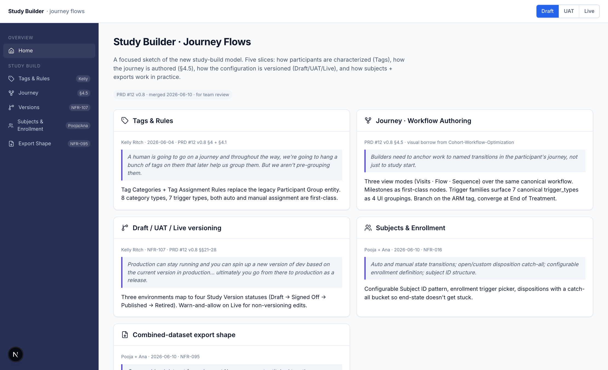
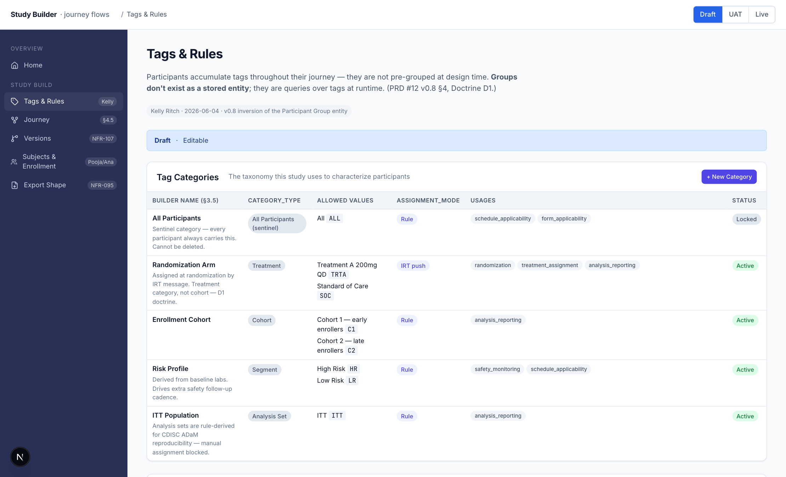
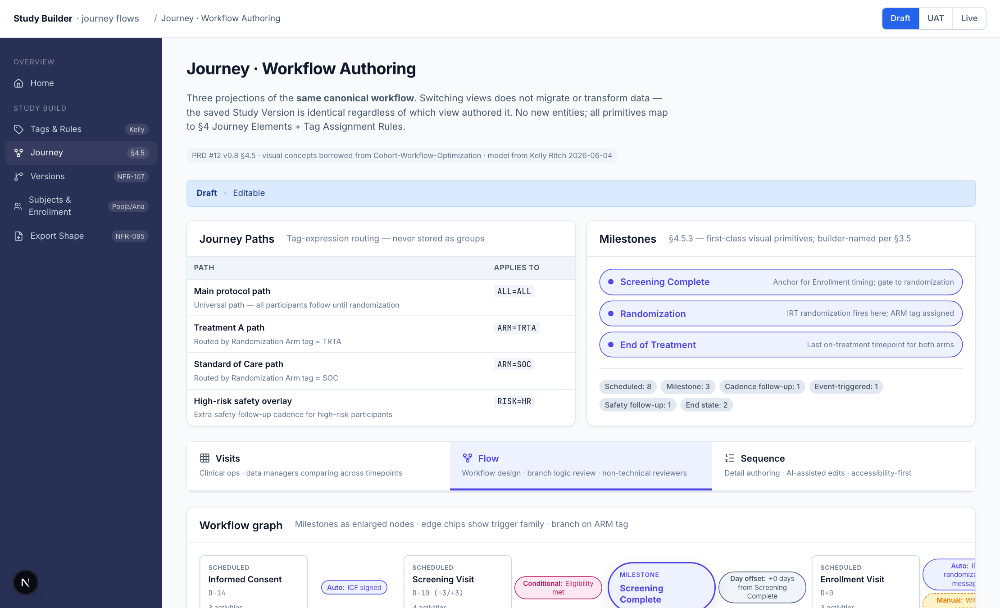
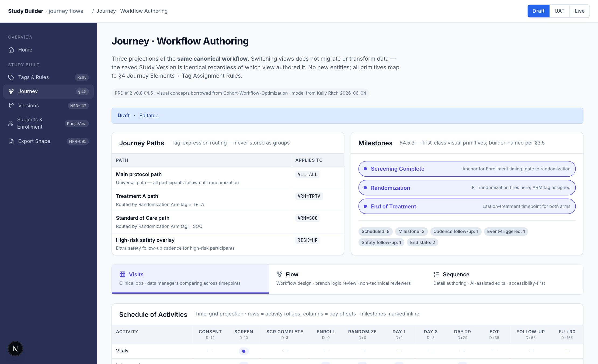
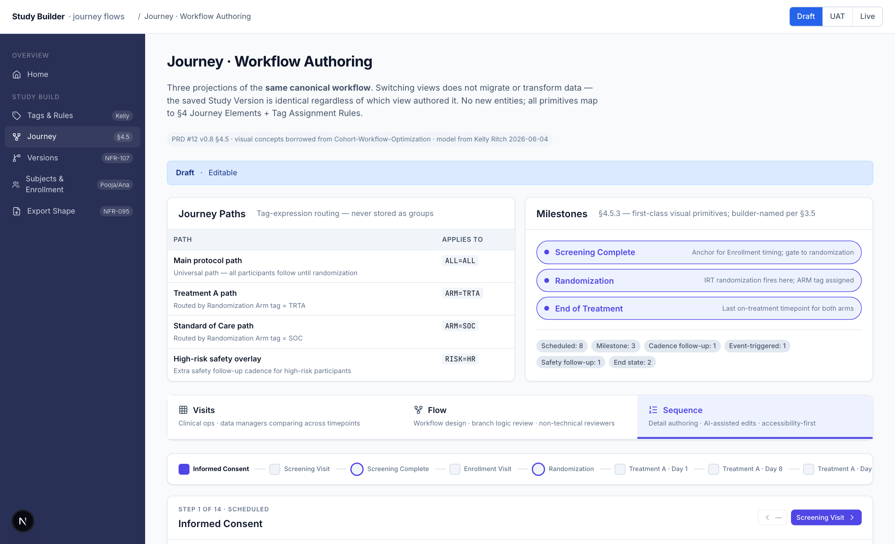
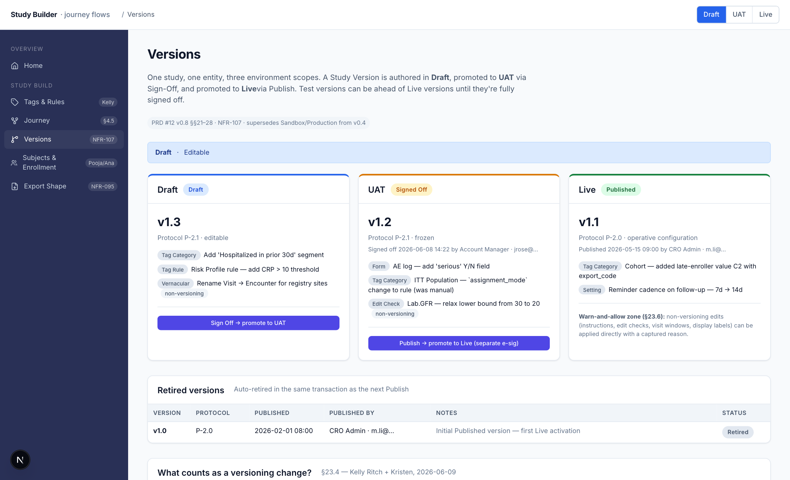
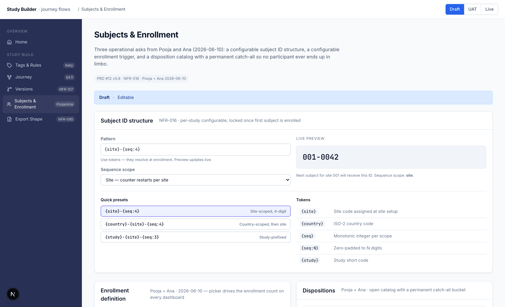
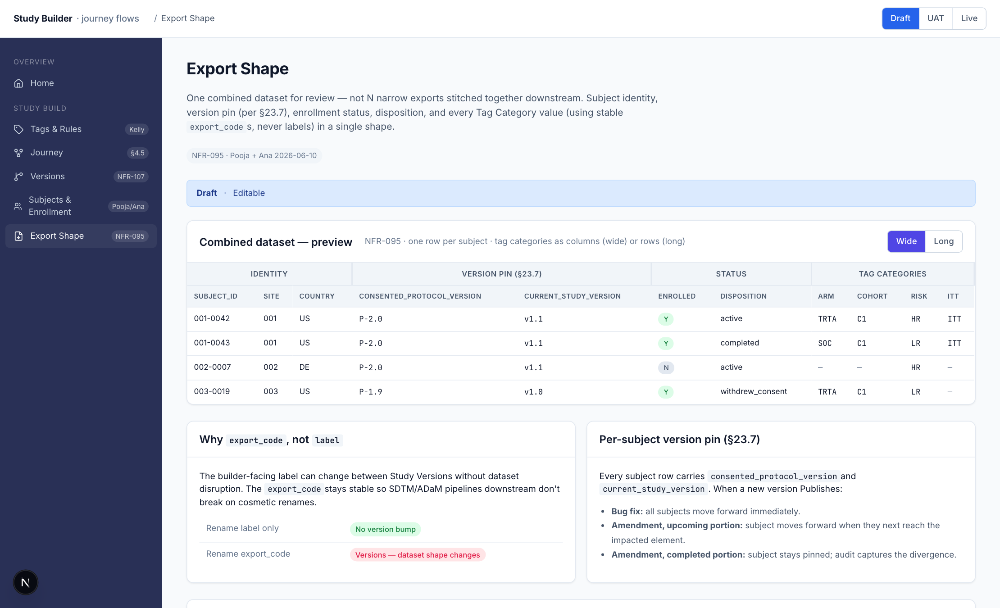

# Study Builder & Journey Flows

A focused click-through sketch of the **new study-build model** for TalOS v2 —
the version that landed in PRD #12 v0.8 after Kelly Ritch's 2026-06-04 input
and Pooja + Ana's 2026-06-10 operational follow-ups.

This is **not** a port of `t6v2prototype`. It's a small, opinionated repo built
for one purpose: walk the team through the new model and surface gaps before
we commit the same patterns into the production prototype.

## Tour

> Open `public/screens/` for full-resolution captures. Screenshots are PNG at
> 1480 × variable height (full page), 1.5× DPR.

### 1 · Landing — five slices of the model



One card per slice with the source quote from Kelly, Pooja, or Ana that drove it.

---

### 2 · Tags & Rules — Kelly's inversion of the Participant Group entity



Tag Categories with `category_type` / `allowed_values` (label + stable
`export_code`) / `assignment_mode` / `usages`. Tag Assignment Rules with all
seven canonical `trigger_type` values demonstrated. A worked example shows tag
accumulation for one subject across consent → enrollment → randomization →
override → analysis-set assignment.

---

### 3 · Journey · Workflow Authoring — three view modes, one canonical workflow

The Workflow Authoring Surface (§4.5) is the visual layer over Journey Paths,
Journey Elements, and Tag Assignment Rules. All three views read/write the
same canonical data — switching views never migrates anything.

**Flow view** — visual graph; milestones as enlarged nodes; trigger-family
chips on edges; branch on the ARM tag converging at End of Treatment:



**Visits view** — Schedule-of-Activities-style matrix; rows = activity
rollups, columns = day offsets; milestone columns highlighted:



**Sequence view** — step-by-step; one element in focus at a time; block
steps + incoming/outgoing transitions. R1.0 ships read-equivalent; full
drag-and-drop reordering lands in R1.1:



---

### 4 · Versions — Draft / UAT / Live lattice



Three environments, four Study Version statuses (Draft → Signed Off →
Published → Retired). Kelly's §23.4 rule table for what counts as a versioning
change. Retired history below. Sponsor SOP override (strict-rule-table vs
force-version-on-every-change) called out for old-school customers.

---

### 5 · Subjects & Enrollment — Pooja + Ana ops



Configurable Subject ID structure (NFR-016) with live token-preview, an
enrollment-trigger picker (Consented · Screened & Eligible · Randomized ·
First Dose · Custom), a disposition catalog with a permanent **catch-all**
bucket so no participant ends up in limbo, and a side-by-side table of
auto-advance rules and manual-advance permissions.

---

### 6 · Export Shape — one combined dataset



NFR-095 — one combined dataset for review, not N narrow exports stitched
together downstream. Wide vs long shape toggle. Stable `export_code`s as
column values (never builder-facing labels). Per-subject version pin per
§23.7 (`consented_protocol_version` + `current_study_version`).

---

## What's inside

| Route | Demonstrates | Source |
| --- | --- | --- |
| `/study/tags`     | Tag Categories + Tag Assignment Rules — replaces the legacy "Participant Group" entity (Doctrine D1, v0.8) | PRD #12 v0.8 §4 + §4.1 |
| `/study/journey`  | Workflow Authoring Surface — Visits / Flow / Sequence view modes, milestone-as-node, trigger families | PRD #12 v0.8 §4.5 |
| `/study/versions` | Draft / UAT / Live lattice; Kelly's "what counts as a versioning change" rule table | PRD #12 v0.8 §§21–28 · NFR-107 |
| `/study/subjects` | Configurable Subject ID, configurable enrollment definition, disposition catch-all, auto + manual state transitions | Pooja + Ana 2026-06-10 · NFR-016 |
| `/study/export`   | Combined-dataset export shape (wide and long), per-subject version pin, delivery channels | Pooja + Ana 2026-06-10 · NFR-095 |

A persistent env switcher in the topbar (Draft / UAT / Live) demonstrates how
the same configuration surface changes posture per environment per §23.6
(warn-and-allow on Live).

## What's explicitly *not* in scope

- **AI Import Wizard (Story 1)** and **Template flow (Story 2)** — separate review.
- **eCRF Builder, Edit Checks library** — these consume Tags / Versions / Journey, they don't author them.
- **Full drag-and-drop authoring in Sequence view** — lands in R1.1 per §4.5.

## Visual borrow

Visual concepts on `/study/journey` adapted from
[`priyame/Cohort-Workflow-Optimization`](https://github.com/priyame/Cohort-Workflow-Optimization)
— the three-view-mode pattern, the trigger taxonomy, and milestone-as-node.
The foundational model stays Kelly's tag-and-rules per §4 — the
prototype's pre-Kelly `Arm` / `Visit` types are not carried into this repo.

## Stack

- Next.js 16.2 (App Router)
- React 19.2
- TypeScript
- `lucide-react` for icons
- No Tailwind — CSS variables + a single `globals.css` modeled on
  `t6v2prototype`'s design tokens

## Run locally

```bash
npm install
npm run dev
# → http://localhost:3000 (or 3001 if 3000 is taken)
```

## Regenerate screenshots

```bash
npm run dev &              # start dev server
npx tsx scripts/screenshot.ts
# → writes public/screens/*.png
```

## Domain types

The canonical model lives in `lib/kelly-model.ts` and `lib/journey-model.ts`
— read these first if you're joining the review cold. They mirror PRD #12 v0.8
§4 and §4.5 verbatim:

- `TagCategory` (8 `category_type`s, 5 `assignment_mode`s, ≥1 `usage`)
- `TagAssignmentRule` (7 canonical `trigger_type`s)
- `StudyVersion` (4 statuses across 3 environments)
- `JourneyElement` (8 `element_type`s incl. milestone)
- `JourneyEdge` + `TriggerFamily` (4-family UI grouping over the 7 canonical triggers)
- `SubjectIdConfig`, `EnrollmentDefinition`, `Disposition` — Pooja + Ana scope

Seed data lives in `components/*/seed.ts` for each slice.
